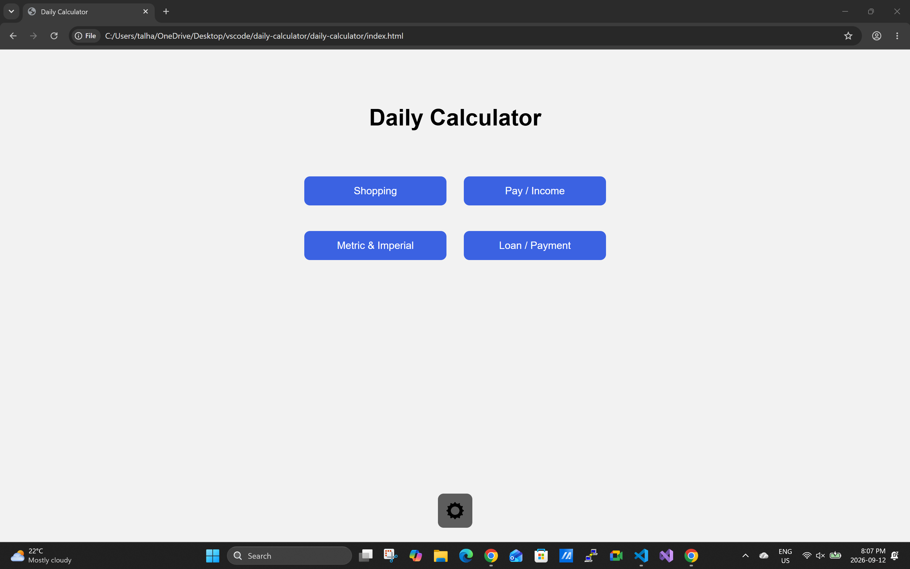
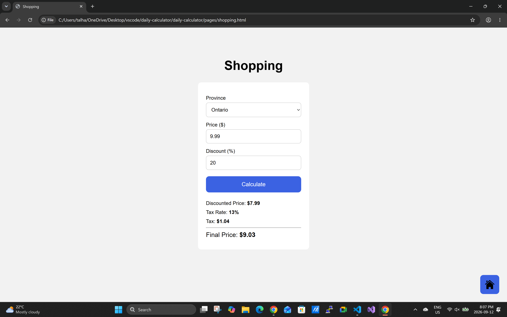
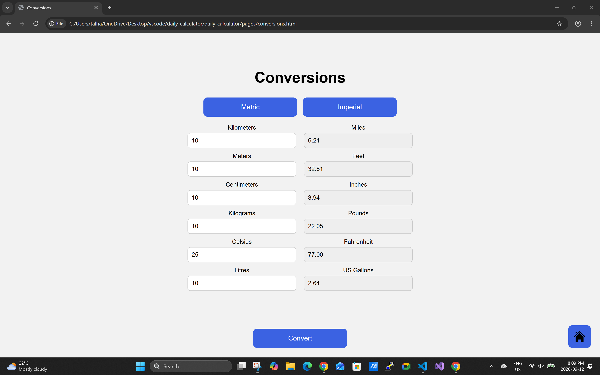
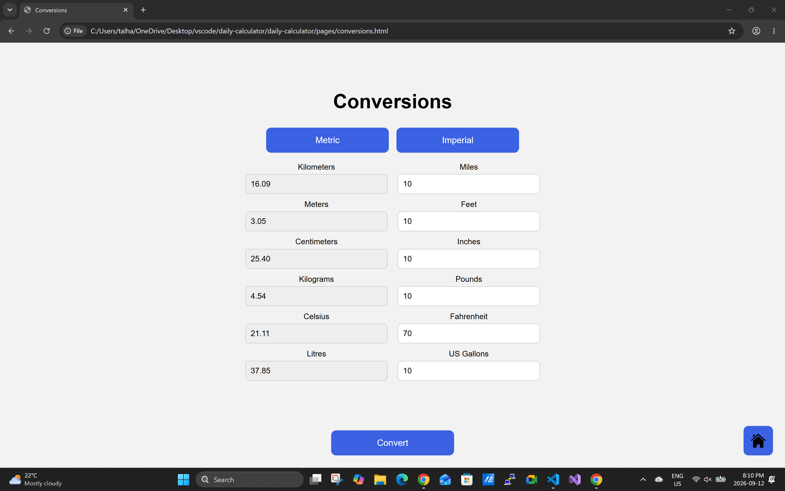
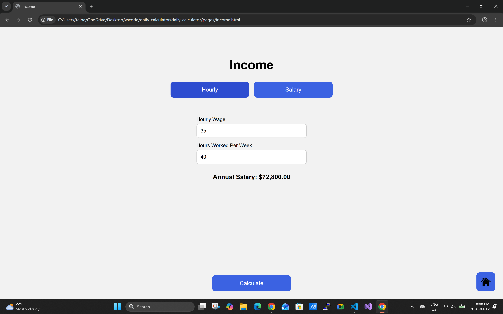
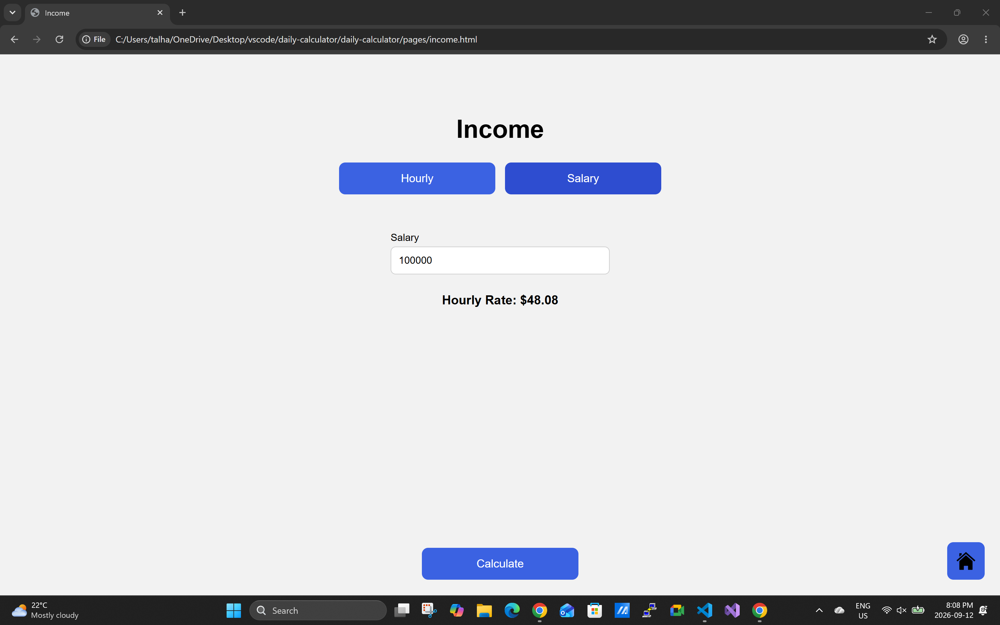
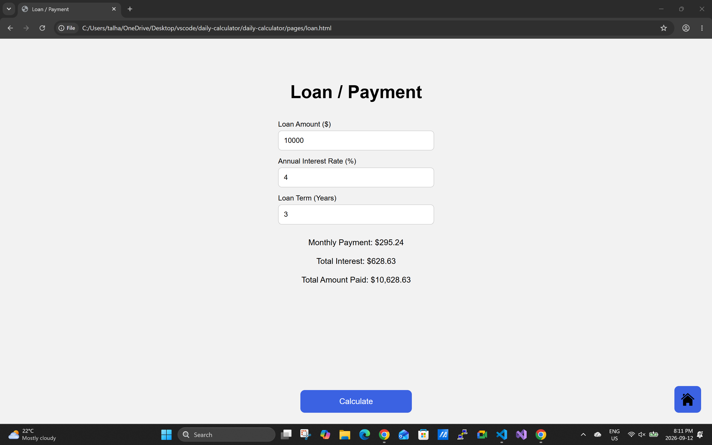
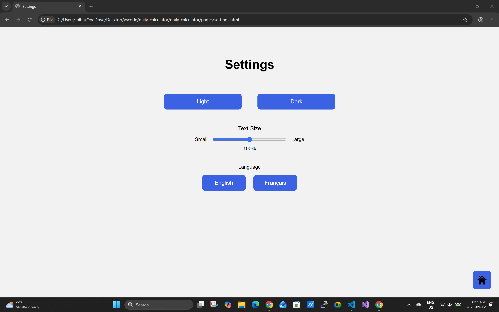

# Daily Calculator
This is a simple web application built using HTML, CSS, and JavaScript.

## Features

- Home Page

- Shopping Calculator: The user selects a province, enters the price, and can optionally enter a discount percentage. The calculator then displays the discounted price, tax rate, tax amount, and final price.

- Metric & Imperial Calculator: The user selects either Metric or Imperial and enters at least one value from the six available conversion fields. For instance, if the user selects Imperial and enters a value in miles, clicking the Convert button returns the equivalent value in kilometers.

- Pay / Income Calculator: The user selects either Hourly or Salary. If Hourly is selected, the user enters their hourly wage and hours worked per week to calculate their annual salary. If Salary is selected, the user enters their annual salary to calculate the hourly rate based on a standard 40 hour work week and 52 weeks per year.

- Loan / Payment Calculator: The user enters the loan amount, annual interest rate, including 0%, and the loan term in years. The calculator then displays the monthly payment, total interest, and total amount paid.

- Settings Page: The user can select either Light or Dark mode for all pages. The text size can be adjusted from 90% to 110%. The application can also be switched between English and French.

## Live Demo

## Author
Talha Ghori